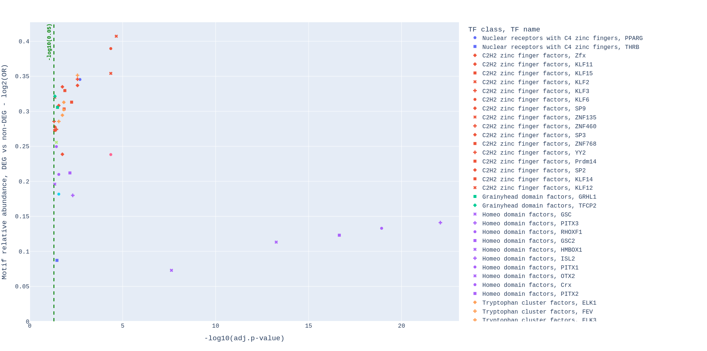

# ESDEG

## Introduction
We developed approach that estimates the enrichment of motifs respecting transcription factor binding sites (TFBS) in promoters of differentially expressed genes (DEGs) derived from RNA-seq experiment.

* You can find more details in article _Oshchepkov, Dmitry, Irina Chadaeva, Rimma Kozhemyakina, Svetlana Shikhevich, Ekaterina Sharypova, Ludmila Savinkova, Natalya V. Klimova, Anton Tsukanov, Victor G. Levitsky, and Arcady L. Markel. 2022. "Transcription Factors as Important Regulators of Changes in Behavior through Domestication of Gray Rats: Quantitative Data from RNA Sequencing" International Journal of Molecular Sciences 23, no. 20: 12269. https://doi.org/10.3390/ijms232012269_


## Requirements

ESDEG is a command-line toolkit and Python package for estimating the enrichment of motifs in promoters. ESDEG runs on [Python](https://www.python.org/) 3.7 and later. Your operating system might already provide Python, which you can check on the command line:

```
python --version
```
### Python dependencies

If you haven't already satisfied these dependencies on your system, install
these Python packages via ``pip``:

  * numpy
  * scipy
  * pythran
  * pandas
  * statsmodels
  * biopython
  * pyjaspar

```
pip install numpy, scipy, plotly, statsmodels, pythran, pandas, biopython, pyjaspar
```

## Installation

```  
git clone https://github.com/ubercomrade/esdeg.git  
cd esdeg  
pip install -e .  
```

## Usage
The command `ESDEG.py -h` return:

```
usage: ESDEG.py [-h] {preparation,deg,set} ...

positional arguments:
  {preparation,deg,set}
                        Available commands:
    preparation         Run data base preparation
    deg                 Run test on DEGs
    set                 Run test on SET of genes

options:
  -h, --help            show this help message and exit

```

ESDEG includes three commands: `preparation`, `deg` and `set`.

The first step is to prepare the database using the command `preparation`. This step requires motifs, which are taken from JASPAR, as well as promoters of the same length in FASTA format ([example](https://github.com/ubercomrade/esdeg/blob/main/example/hs.ensembl.promoters.fa.xz)), which are set by the user. The results of command `preparation` is database that includes motifs search results in `.npy` format. This database is further used as an input for `deg` and `set` commands.

The next step is depending on type of input data.

If you have comma-separated table including results of differentially expressed genes ([example](https://github.com/ubercomrade/esdeg/blob/main/example/E-GEOD-48230-query-results.csv)) you should use command `deg`.

If you have set of genes ([example](https://github.com/ubercomrade/esdeg/blob/main/example/HALLMARK_TNFA_SIGNALING_VIA_NFKB.txt)) you should use command `set`.

## Preparation

This step requires (a) the library of motifs, which are extracted from the [JASPAR](https://jaspar.uio.no/), and (b) promoters of the same length in FASTA format [example](https://github.com/ubercomrade/esdeg/blob/main/example/hs.ensembl.promoters.fa.xz), which are set by the user. The results of the command preparation represent a database including the list of motifs and their annotations in .npy format. This database is used further as an input for deg and set commands.

_Timing 40–120 min_

```
usage: ESDEG.py preparation [-h]
                            {plants,vertebrates,insects,urochordates,nematodes,fungi}
                            N output

positional arguments:
  {plants,vertebrates,insects,urochordates,nematodes,fungi}
                        Prepare database for respective JASPAR CORE taxonomic
                        group of motifs. Possible options are plants,
                        vertebrates, insects, urochordates, nematodes, fungi.
                        For more details see https://jaspar.uio.no/ and
                        https://pyjaspar.readthedocs.io/en/latest/index.html
  promoters             Path to promoters in fasta format. All promoters have
                        to be with same length. After ">" unique gene ID have
                        to be written (>ENSG00000160072::1:1469886-1472284 or
                        >ENSG00000160072)
  output                Name of directory to write output files

options:
  -h, --help            show this help message and exit
```
#### Required arguments description

**First positional argument** `matrices`:

It's name of taxon that is avaliable in JASPAR database[^1]. Possible options for taxon are _plants_, _vertebrates_, _insects_, _urochordates_, _nematodes_, _fungi_.
Only motifs from CORE COLLECTION and with length >= 8 are used for analysis.
For more details see https://jaspar.uio.no/ and https://pyjaspar.readthedocs.io/en/latest/index.html

**Second positional argument** `promoters`:

Argument `promoters` is the path to file with promoters in FASTA format. Promoters have to have same length. After ">" unique gene ID have to be written (>ENSG00000160072::1:1469886-1472284 or >ENSG00000160072)

[Example](https://github.com/ubercomrade/esdeg/blob/main/example/hs.ensembl.promoters.fa.xz):
```
>ENSG00000160072::1:1469886-1472284
ACATTCCACCATTGTGATTTGTTTCTGCCCCACCCTAG...
>ENSG00000142611::1:3067261-3069659
TCGATAGACCCTCGAAAGGACGGCAGGGAATGGGGCTG...
>ENSG00000157911::1:2412102-2414502
GGACCTGCCCTGAGCTGGGGACGGGAAGGGCTTGGGCG...
>ENSG00000142655::1:10472968-10475366
ATCGGAGAGGAAAGGGGAAATGCGACTCGGCACTGTTG...
```
This type of FASTA file can be generated by using `bedtools getfasta` (https://bedtools.readthedocs.io/en/latest/)[^2] with flag `-name+`

**Third positional argument** `output`:

Directory to write prepared database of motifs.

#### Optional arguments description

**First optional argument** `-h; --help` :

Print help to STDOUT

## DEG case

This command is used when you have comma-separated table including results of differentially expressed genes ([example](https://github.com/ubercomrade/esdeg/blob/main/example/E-GEOD-48230-query-results.csv)). This command allows you to detect which motifs are enriched in differentially expressed genes compared to a background. Differentially expressed genes are determined by parameters: `--pvalue` and `--log2fc_deg`. Background is determined by parameters: `--pvalue` and `--log2fc_back`. See below.

_Timing from 10 seconds to 5 minutes_

``````
usage: ESDEG.py deg [-h] [-v VISUALIZATION] [-p PARAMETER] [-r N] [-P PVALUE]
                    [-l LOG2FC_DEG] [-L LOG2FC_BACK] [-c CONTENT]
                    deg matrices output

positional arguments:
  deg                   TSV file with DEG with ..., The NAME column must
                        contain ensemble gene IDS
  matrices              Path to prepared data base of matrices
  output                Path to write table with results

options:
  -h, --help            show this help message and exit
  -v VISUALIZATION, --visualization VISUALIZATION
                        Path to write interactive picture in HTML format
                        (path/to/pic.html). if '--v' is given, then ESDEG
                        creates picutre. By default it isn't used
  -p PARAMETER, --parameter PARAMETER
                        Parameter estimated in test (enrichment or fraction),
                        default= enrichment
  -r N, --regulated N   The parameter is used to choose up/down/all DEGs,
                        default= all
  -P PVALUE, --pvalue PVALUE
                        The pvalue is used as threshold to choose DEGs,
                        default= 0.05
  -l LOG2FC_DEG, --log2fc_deg LOG2FC_DEG
                        The absolute value of log2FoldChange used as threshold
                        to choose DEGs promoters (DEGs >= thr OR DEGs <=
                        -thr), default= 1
  -L LOG2FC_BACK, --log2fc_back LOG2FC_BACK
                        The absolute value of log2FoldChange used as threshold
                        to choose background promoters (-thr <= BACK <= thr),
                        default= log2(5/4)=0.376287495
  -c CONTENT, --content CONTENT
                        The maximal GC content difference between promoters of
                        foreground and background in Monte Carlo algorithm.
                        Range of possible threshold [0.01 .. 1.0]. If
                        threshold is equal to 1.0 then GC content is not taken
                        into account. In this case (thr = 1.0) algorithm works
                        faster. Default= 0.3.
``````

#### Required arguments description

**First positional argument** `deg` :

It's PATH to your Comma-separated file with full list of DEGs with required columns: id, log2FoldChange, padj ([example](https://github.com/ubercomrade/esdeg/blob/main/example/E-GEOD-48230-query-results.csv)). Similar table can be generated by DESeq2[^3] (https://bioconductor.org/packages/release/bioc/html/DESeq2.html) or IRIS[^4] (https://bmbls.bmi.osumc.edu/IRIS/).

[Example](https://github.com/ubercomrade/esdeg/blob/main/example/E-GEOD-48230-query-results.csv):
```
id,log2FoldChange,padj
ENSG00000000003,-0.2,0.472804281
ENSG00000000419,0.2,0.46039097
ENSG00000000457,-0.1,0.841129918
ENSG00000000460,0.2,0.534296601
ENSG00000000971,-1.4,1.06E-05
ENSG00000001036,0.1,0.81968747
ENSG00000001167,-0.2,0.444068007
ENSG00000001460,-0.1,0.808782152
```
**!IMPORTANT! You have to use the same gene IDs as those used in the preparation step for promoters**

**Second positional argument** `matrices`:

It's PATH to directory with motifs database prepared by `ESDEG.py preparation`

**Third positional argument** `output`:

Path to write result table.


#### Optional arguments description

**First optional argument** `-h; --help` :

Print help to STDOUT

**Second optional argument** `-v; --visualization` :

It's PATH to write HTML report (picture). Plotly is used for visualization.

**Third optional argument** `-p; --parameter` :

The value of `-p; --parameter ` could be  _enrichment_ or _fraction_. If you choose _enrichment_, statistics are calculated based on number of TFBS in DEGs promoters. In this case number of TFBS in each promoters may play role and influences the result. If you choose _fraction_, statistics are calculated based on number of DEGs with TFBS.  In this case number of TFBS in promoters doesn't matter. The default value is _enrichment_.

**Fourth optional argument** `-r; --regulated` :

The argument `-r/--regulated` are used to choose type of DEGs in analysis. It could be `down` -> promoters of down regulated genes will be used in analysis; `up` -> promoters of up regulated genes will be used in analysis; `all` -> promoters of  up and down regulated genes will be used in analysis. The default value is _all_.

**Fifth optional argument** `-p; --pvalue` :

The argument  `-p; --pvalue ` is pvalue cutoff for DEGs choosing (DEGs <= pvalue). The default value is _0.05_.

**Sixth optional argument** `-l; --log2fc_deg` :

The argument  `-l; --log2fc_deg ` is Log2FoldChange cutoff for DEGs choosing (DEGs >= Log2FoldChange OR DEGs <= -Log2FoldChange). The default value is _1_.

**Seventh optional argument** `-l; --log2fc_back` :

The argument  `-l; --log2fc_back ` is Log2FoldChange cutoff for background choosing (-Log2FoldChange <= BACKGROUND <= Log2FoldChange). The default value is _log2(5/4) = 0.376287495_.

**Eighth optional argument** `-c; --content` :

The argument `-c; --content` is used to set threshold of GC content for generating background.


## SET case

This command is used when you have set of genes ([example](https://github.com/ubercomrade/esdeg/blob/main/example/E-GEOD-48230-query-results.csv)). This command allows you to detect which motifs are enriched in a given set of genes (foreground) compared to a background. Background includes all genes from database except given as a foreground.

_Timing from 10 seconds to 5 minutes_

````
usage: ESDEG.py set [-h] [-v VISUALIZATION] [-p PARAMETER] [-c CONTENT]
                    set matrices output

positional arguments:
  set                   File with list of genes.
  matrices              Path to prepared data base of matrices
  output                Path to write table with results

options:
  -h, --help            show this help message and exit
  -v VISUALIZATION, --visualization VISUALIZATION
                        Path to write interactive picture in HTML format
                        (path/to/pic.html). if '--v' is given, then ESDEG
                        creates picutre. By default it isn't used
  -p PARAMETER, --parameter PARAMETER
                        Parameter estimated in test (enrichment or fraction),
                        default= enrichment
  -c CONTENT, --content CONTENT
                        The maximal GC content difference between promoters of
                        foreground and background in Monte Carlo algorithm.
                        Range of possible threshold [0.01 .. 1.0]. If
                        threshold is equal to 1.0 then GC content is not taken
                        into account. In this case (thr = 1.0) algorithm works
                        faster. Default= 0.3.
````

#### Required arguments description

**First positional argument** `set` :

It's PATH to file with your SET of genes. [Example](https://github.com/ubercomrade/esdeg/blob/main/example/HALLMARK_TNFA_SIGNALING_VIA_NFKB.txt):
```
ENSG00000072415
ENSG00000094796
ENSG00000143217
ENSG00000038427
ENSG00000186480
...
```
**!IMPORTANT! You have to use the same gene IDs as those used in the preparation step for promoters**

**Second positional argument** `matrices`:

It's PATH to directory with motifs database prepared by `ESDEG.py preparation`

**Third positional argument** `output`:

Path to write result table.

#### Optional arguments description

**First optional argument** `-h; --help` :

Print help to STDOUT

**Second optional argument** `-v; --visualization` :

It's PATH to write HTML report (picture). Plotly is used for visualization.

**Third optional argument** `-p; --parameter` :

Options for `-p; --parameter ` are  _enrichment_ and _fraction_. If you choose _enrichment_, statistics are calculated based on number of TFBS in DEGs promoters. In this case number of TFBS in each promoters may play role and influences the result. If you choose _fraction_, statistics are calculated based on number of DEGs with TFBS.  In this case number of TFBS in promoters doesn't matter. The default value is _enrichment_.

**Fourth optional argument** `-c; --content` :

The argument `-c; --content` is used to set threshold of GC content for generating background.\


## Example run

Bash script with examples and data are located in `./example/example_run.sh` . You should run this script in `./example` directory.

```
ESDEG.py preparation \
vertebrates \
hs.ensembl.promoters.fa \
./matrices_db
```

```
ESDEG.py deg \
./E-GEOD-48230-query-results.csv \
./matrices_db \
./ovol1.montecarlo.enrichment.tsv \
--visualization ./ovol1.montecarlo.enrichment.html \
--parameter enrichment \
--regulated down
```

## Output file format
ESDEG generates output file in tsv format.
Here is example of file:
```
motif_id  tf_name tf_class  log(or) pval  adj.pval  genes
MA0019.1  Ddit3::Cebpa  Basic leucine zipper factors (bZIP)::Basic leucine zipper factors (bZIP)  -0.063665522  0.711293915 1 ENSG00000003402;ENSG00000011422;ENSG00000049249;ENSG00000056558;ENSG00000059728;...
MA0029.1  Mecom C2H2 zinc finger factors  -0.213969457  0.907755585 1 ENSG00000003402;ENSG00000011422;ENSG00000023445;ENSG00000041982;ENSG00000049249;...
MA0030.1  FOXF2 Fork head/winged helix factors  -0.006612028  0.477107525 1 ENSG00000003402;ENSG00000011422;ENSG00000023445;ENSG00000026508;ENSG00000041982;...
MA0031.1  FOXD1 Fork head/winged helix factors  0.067523999 0.274632407 0.810214468 ENSG00000003402;ENSG00000011422;ENSG00000023445;ENSG00000026508;ENSG00000034152;...
MA0040.1  Foxq1 Fork head/winged helix factors  0.050899917 0.305765883 0.862176588 ENSG00000003402;ENSG00000011422;ENSG00000023445;ENSG00000026508;ENSG00000041982;...
MA0051.1  IRF2  Tryptophan cluster factors  0.230432614 0.015907183 0.106348861 ENSG00000003402;ENSG00000011422;ENSG00000026508;ENSG00000034152;ENSG00000041982;...
MA0059.1  MAX::MYC  Basic helix-loop-helix factors (bHLH)::Basic helix-loop-helix factors (bHLH)  -0.005683188  0.50891945  1 ENSG00000003402;ENSG00000011422;ENSG00000026508;ENSG00000034152;ENSG00000056558;...
MA0066.1  PPARG Nuclear receptors with C4 zinc fingers  -0.281050979  0.96028856  1 ENSG00000003402;ENSG00000011422;ENSG00000023445;ENSG00000026508;ENSG00000034152;...
MA0069.1  PAX6  Paired box factors  -0.051719521  0.697035117 1 ENSG00000003402;ENSG00000011422;ENSG00000023445;ENSG00000026508;ENSG00000034152;...
```
Where:
**motif_id** - jaspar id from data base.

**tf_name** - name of Transcrition factor

**tf_class** - class of DBD's transcrition factor

**log(or)** - it's -log2 transforamation of  odds ratio (OR). It could be defined as $OR = N_f / N_b$, where $N_f$ - is the number of foreground promoters with predicted sites and $N_b$ - is a mean value of number of background promoters with predicted sites estimated by Monte-Carlo approach (fraction approach). Also It could be defined as $OR = N_f / N_b$, where $N_f$ - is a number of predicted sites in foreground and $N_b$ - is the mean value of number of predicted sites in background estimated by Monte-Carlo approach (enrichment approach)

**pval** - it's combined p-value culculated by Hartung method[^5].

**adj.pval** - adjasted p-value by Benjamini-Hochberg FDR correction. `statsmodels` is used to apply this correction.

**genes** - list of genes with predicted sites (threshold(ERR) = 0.0005).

## Results visualization



## Reference

[^1]: Castro-Mondragon, J. A., Riudavets-Puig, R., Rauluseviciute, I., Lemma, R. B., Turchi, L., Blanc-Mathieu, R., Lucas, J., Boddie, P., Khan, A., Manosalva Pérez, N., Fornes, O., Leung, T. Y., Aguirre, A., Hammal, F., Schmelter, D., Baranasic, D., Ballester, B., Sandelin, A., Lenhard, B., Vandepoele, K., … Mathelier, A. (2022). JASPAR 2022: the 9th release of the open-access database of transcription factor binding profiles. Nucleic acids research, 50(D1), D165–D173. https://doi.org/10.1093/nar/gkab1113
[^2]: Quinlan, A. R., & Hall, I. M. (2010). BEDTools: a flexible suite of utilities for comparing genomic features. Bioinformatics (Oxford, England), 26(6), 841–842. https://doi.org/10.1093/bioinformatics/btq033
[^3]: Love, M. I., Huber, W., & Anders, S. (2014). Moderated estimation of fold change and dispersion for RNA-seq data with DESeq2. *Genome Biology*, *15*(12), 550. https://doi.org/10.1186/s13059-014-0550-8
[^4]: Monier, B., McDermaid, A., Wang, C., Zhao, J., Miller, A., Fennell, A., & Ma, Q. (2019). IRIS-EDA: An integrated RNA-Seq interpretation system for gene expression data analysis. *PLOS Computational Biology*, *15*(2), e1006792. https://doi.org/10.1371/journal.pcbi.1006792
[^5]: Hartung, J. (1999). A note on combining dependent tests of significance. Biometrical Journal, 41(7), 849-855.

## Citing

Oshchepkov, D., Chadaeva, I., Kozhemyakina, R., Shikhevich, S., Sharypova, E., Savinkova, L., Klimova, N. V., Tsukanov, A., Levitsky, V. G., & Markel, A. L. (2022). Transcription Factors as Important Regulators of Changes in Behavior through Domestication of Gray Rats: Quantitative Data from RNA Sequencing. International journal of molecular sciences, 23(20), 12269. https://doi.org/10.3390/ijms232012269

## License

Copyright (c) 2021 Anton Tsukanov

Permission is hereby granted, free of charge, to any person obtaining a copy
of this software and associated documentation files (the "Software"), to deal
in the Software without restriction, including without limitation the rights
to use, copy, modify, merge, publish, distribute, sublicense, and/or sell
copies of the Software, and to permit persons to whom the Software is
furnished to do so, subject to the following conditions:

The above copyright notice and this permission notice shall be included in all
copies or substantial portions of the Software.

THE SOFTWARE IS PROVIDED "AS IS", WITHOUT WARRANTY OF ANY KIND, EXPRESS OR
IMPLIED, INCLUDING BUT NOT LIMITED TO THE WARRANTIES OF MERCHANTABILITY,
FITNESS FOR A PARTICULAR PURPOSE AND NONINFRINGEMENT. IN NO EVENT SHALL THE
AUTHORS OR COPYRIGHT HOLDERS BE LIABLE FOR ANY CLAIM, DAMAGES OR OTHER
LIABILITY, WHETHER IN AN ACTION OF CONTRACT, TORT OR OTHERWISE, ARISING FROM,
OUT OF OR IN CONNECTION WITH THE SOFTWARE OR THE USE OR OTHER DEALINGS IN THE
SOFTWARE.
